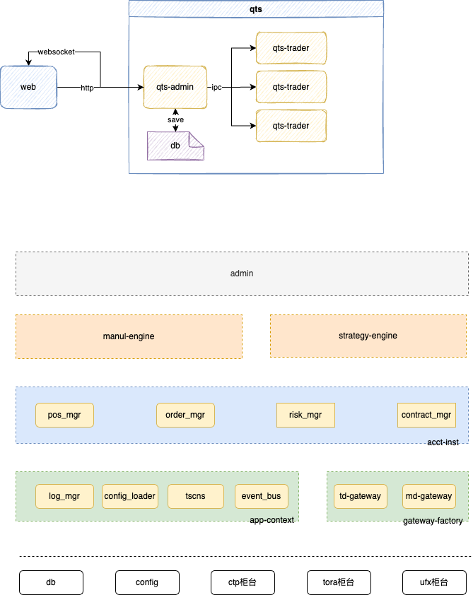

<p align="center">
  
</p>

Quick Trading Sysmtem(Qts)是一款支持多账户的量化交易系统。该系统主要由admin和trader模块组成，admin模块统一管理多个交易执行器，每个账户对应1个交易执行器(trader)，目前trader有2个版本：c++(极速版)、python版本(常规版)。

**qts当前处于开发阶段，正在快马加鞭完善中...**


## 架构

<p align="center">
  
</p>


* qts-admin      管理中心
支持管理多个交易核心
* qts-trader  常规交易核心(python)
常规版本交易程序，一般延迟

* qts-web     [WEB客户端](https://github.com/csuduan/qts-web)
* qts-ctrader    极速交易核心(C++)
C++版交易程序，低延迟(tick2trade<5us)


## 部署启动
1. 环境准备
安装python环境(略)  

2. 启动管理器
```
cd /opt/dev/qts

```

3. 启动交易核心(手动)
```
cd /opt/dev/qts
java -DacctId=xxx -jar qts-trader.jar  
```

4. 启动WEB
* 执行命令 npm run serve
* 浏览器访问http://localhost:8080/


## 参考
