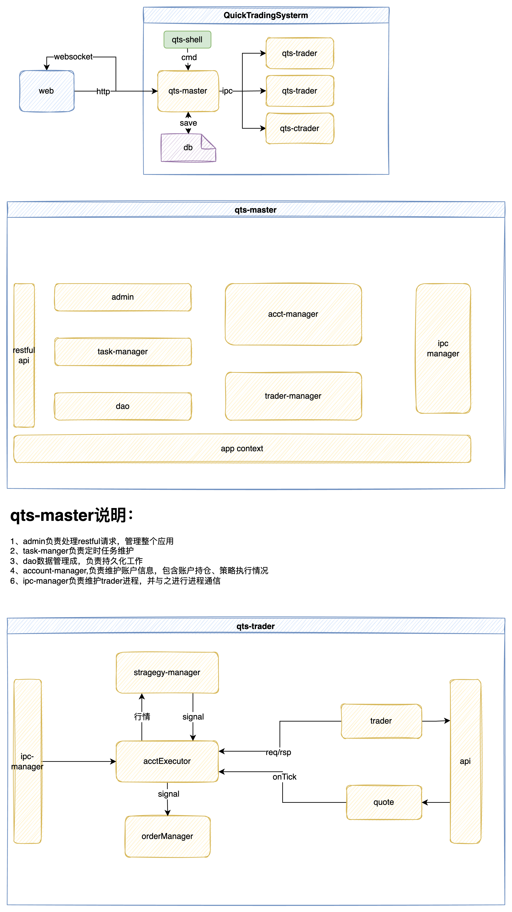

# Quick Trading System
极速交易系统(qts)

**qts当前处于开发阶段，暂不可用，正在快马加鞭中...**


# 架构


* qts-ctrader   交易核心(C++)
C++版交易程序，低延迟(tick2trade<5us)
* qts-trader    交易核心
常规版本交易程序，一般延迟
* qts-master   管理中心
支持管理多个交易核心
* qts-web     WEB客户端


# 部署启动
1. 环境准备
* 服务器安装jdk17
* 拷贝qts.sqlite到服务器中/opt/dev/qts
* 拷贝依赖lib到/opt/dev/qts/qts-master
* 设置环境变量  
```
export LD_LIBRARY_PATH=/opt/dev/qts/qts-master/lib/ctp:$LD_LIBRARY_PATH
```

2. 启动管理器
java qts-admin.jar


3. 启动WEB
* 执行命令 npm run serve
* 浏览器访问http://localhost:8080/


4. 启动交易核心
* 手动启动  java -DacctId=xxx -jar qts-trader.jar  
* qts-admin启动


# 参考
* CTP封装
  https://github.com/sun0x00/swig-java-ctp
```shell
#生成代码
mkdir java_src
swig  -c++ -java -package xyz.redtorch.gateway.ctp.x64v6v3v19p1v.api -outdir java_src -o jctpv6v3v19p1x64api_wrap.cpp jctpv6v3v19p1x64api.i
#编译及打包
javac java_src/*.java
mkdir  -p xyz/redtorch/gateway/ctp/x64v6v3v19p1v/api   
cp java_src/*.class  -p xyz/redtorch/gateway/ctp/x64v6v3v19p1v/api  
jar cf jctp-6.3.19.jar xyz                 

 ```
* redtorch
  https://github.com/sun0x00/redtorch
* 支持的网关类型
  CTP
  OST
  TORA