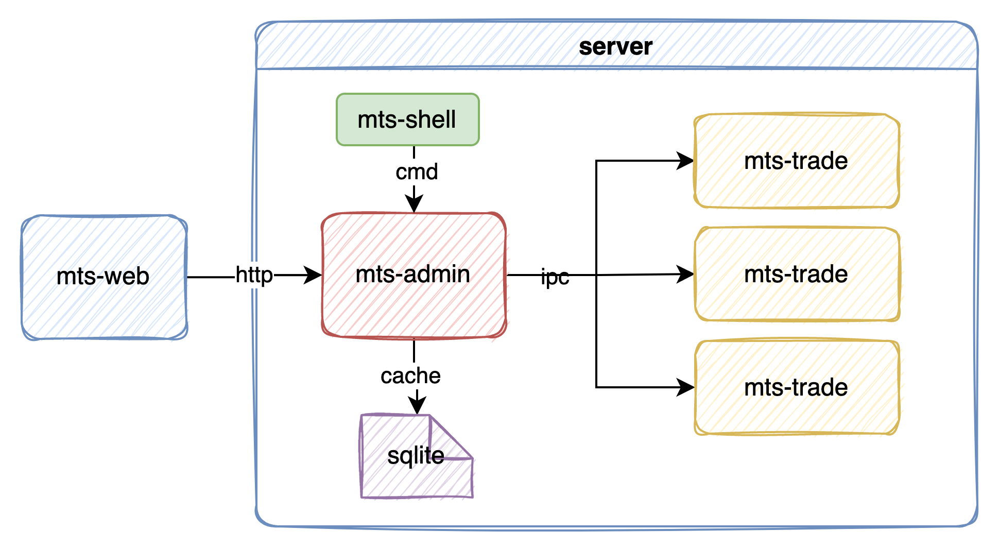

# mts
多账户交易系统

**mts当前处于开发阶段，暂不可用，正在快马加鞭中...**


# 架构


* mts-core    交易核心
C++版低延迟交易程序(tick2trade<5us)
* mts-amin   管理中心
支持管理多个交易核心
* mts-web     WEB客户端


# 部署启动
1. 环境准备
* 拷贝mts.sqlite到/opt/mts/data
* 拷贝依赖lib到/opt/mts/lib

2. 启动管理器
java -Djava.library.path=/tmp/mts/jctp/lib mts-admin.jar

3. 启动交易核心

4. 启动WEB
* 执行命令 npm run serve
* 浏览器访问http://localhost:8080/


# 参考
* CTP封装
  https://github.com/sun0x00/swig-java-ctp
```shell
#生成代码
mkdir java_src
swig  -c++ -java -package xyz.redtorch.gateway.ctp.x64v6v3v19p1v.api -outdir java_src -o jctpv6v3v19p1x64api_wrap.cpp jctpv6v3v19p1x64api.i
#编译及打包
javac java_src/*.java
mkdir  -p xyz/redtorch/gateway/ctp/x64v6v3v19p1v/api   
cp java_src/*.class  -p xyz/redtorch/gateway/ctp/x64v6v3v19p1v/api  
jar cf jctp-6.3.19.jar xyz                 

 ```
* redtorch
  https://github.com/sun0x00/redtorch
* 支持的网关类型
  CTP15  CTP6.3.15
  CTP19  CTP6.3.19
  OST